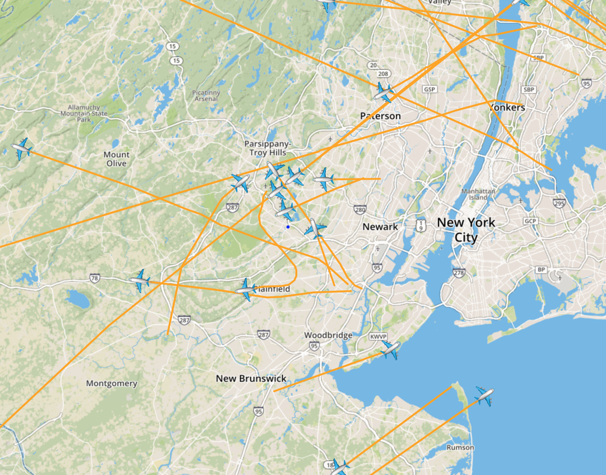

# Aircraft map

Interactive map that shows planes within radio range via ADS-B.

## Usage

1. Acquire an [ADS-B receiver][adsb] and [antenna][antenna].

1. Hook up acquired gear and run [dump1090][dump1090]. I'm using antirez's original
   repo but there are a couple of forks with extended functionality that may
   also work as well.

   `dump1090 --net`

1. Run `PORT=3000 server/index.js`

1. Run `SRC=http://127.0.0.1:8080/data.json DEST=ws://127.0.0.1:3000 node server/relay.js`

1. `open index.html`

    

[adsb]: https://www.amazon.com/FlightAware-Pro-Stick-ADS-B-Receiver/dp/B01D1ZAP3C
[antenna]: https://www.amazon.com/1090Mhz-Antenna-Connector-2-5dbi-Adapter/dp/B013S8B234
[dump1090]: https://github.com/antirez/dump1090
